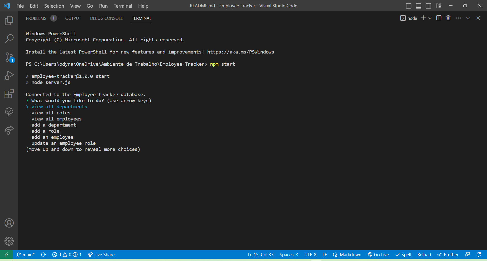
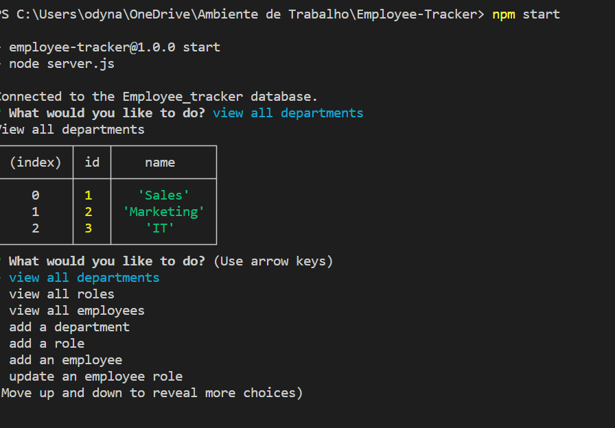
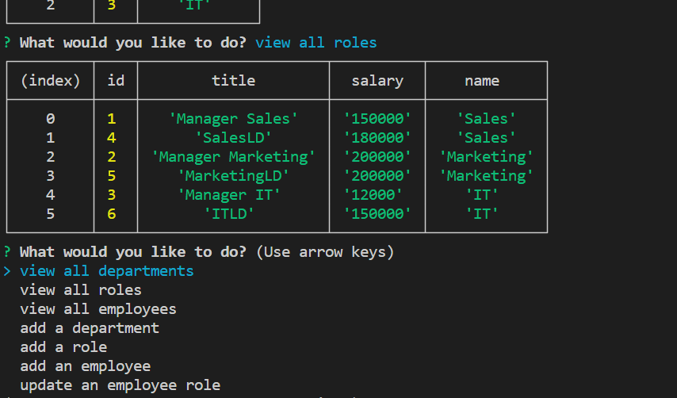
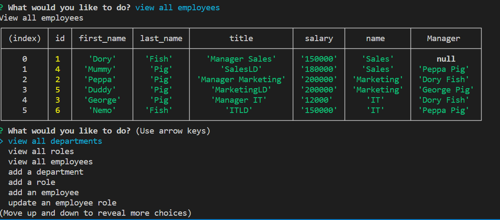
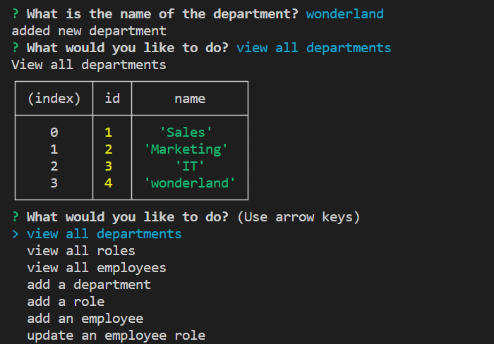
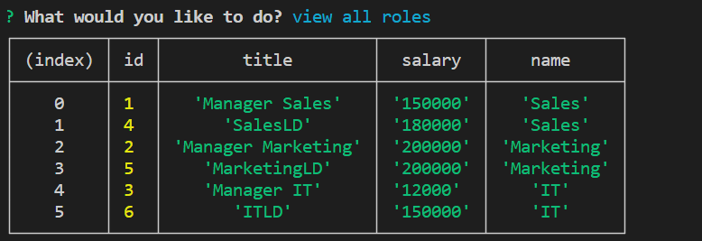

# Employee-Tracker
## Description 📖
command-line application to manage a company's employee database.Allow non-developers to easily view and interact with information stored in databases.

# Walkthrough Video 🎥 

https://watch.screencastify.com/v/OSTUyDChOuo9LVX5fPOJ

# Acceptance Criteria 🔍

WHEN I start the application
THEN I am presented with the following options: view all departments, view all roles, view all employees, add a department, add a role, add an employee, and update an employee role

WHEN I choose to view all departments
THEN I am presented with a formatted table showing department names and department ids

WHEN I choose to view all roles
THEN I am presented with the job title, role id, the department that role belongs to, and the salary for that role

WHEN I choose to view all employees
THEN I am presented with a formatted table showing employee data, including employee ids, first names, last names, job titles, departments, salaries, and managers that the employees report to

WHEN I choose to add a department
THEN I am prompted to enter the name of the department and that department is added to the database

WHEN I choose to add a role
THEN I am prompted to enter the name, salary, and department for the role and that role is added to the database

WHEN I choose to add an employee
THEN I am prompted to enter the employee’s first name, last name, role, and manager, and that employee is added to the database

WHEN I choose to update an employee role
THEN I am prompted to select an employee to update and their new role and this information is updated in the database

# Built With ⚙️

# Installation 🤖
To install the project follow these steps:
1. Clone the application from GitHub with:
   - git clone [clone link from GitHub]
2. From the root folder, install the dependencies with:
   - npm install
3. Run the app with:
   - node server.js
    
# Author 👩‍💻

[][1]

[1]: https://github.com/poucoLouco

[][2]

[2]:https://www.linkedin.com/in/roksolana-odynak-25728025a

## License 📄

